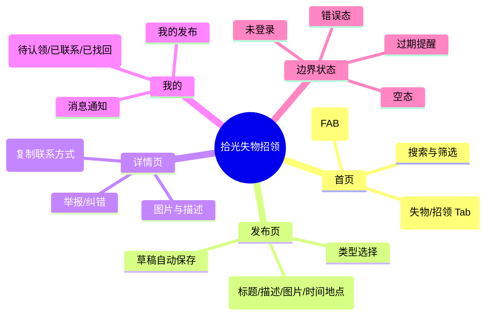

# 信息架构(思维导图)

> 用 Mermaid mindmap 表达, 与 Figma 中 Prototype 页面结构一致(示例)

```mermaid
mindmap
  root((拾光失物招领))
    首页
      搜索与筛选
      信息流(失物/招领 Tab)
      发布入口(FAB)
    发布页
      类型选择
      表单(标题/描述/图片/时间地点)
      草稿自动保存
    详情页
      图片与描述
      联系发布者(复制联系方式)
      举报/纠错
    我的
      我的发布
      状态管理(待认领/已联系/已找回)
      消息通知
    边界状态
      空态
      错误态
      未登录
      过期提醒
```

## 信息层级说明

1. 首页一级信息: 类型 Tab + 信息流(标题、类型、时间地点)
2. 详情页: 图片 > 描述 > 联系方式按钮 > 发布者信息
3. 发布页: 类型 > 标题 > 描述 > 时间地点 > 图片(可选)
