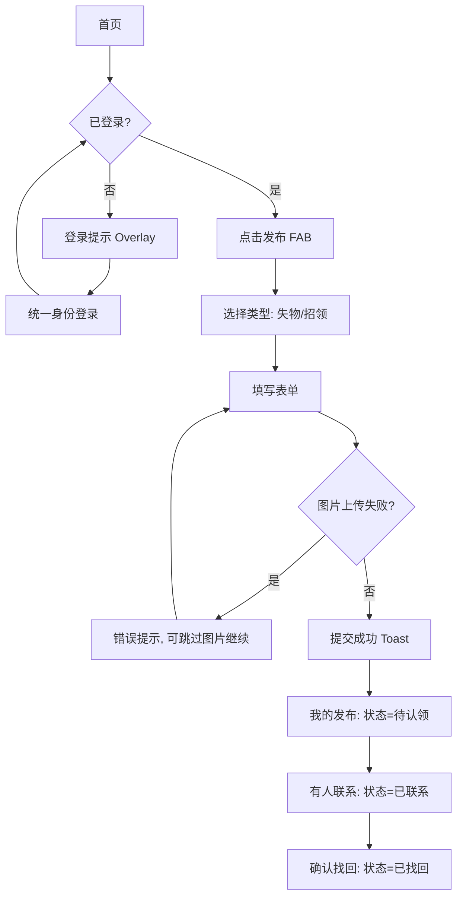
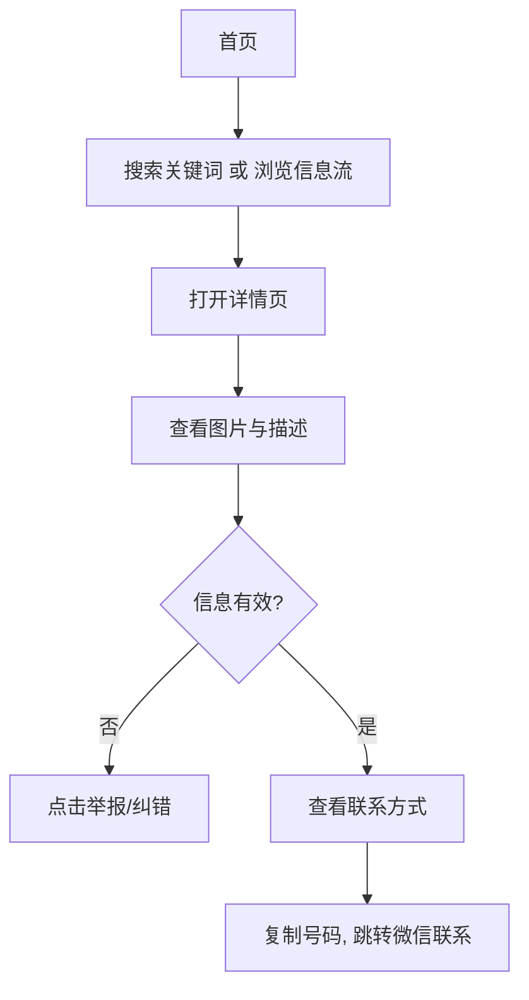

# 核心用户流程

> 发布者主流程(示例, 与 Figma Prototype 连线一致)

```mermaid
flowchart TD
  A[首页] --> B{已登录?}
  B -- 否 --> C[登录提示 Overlay]
  C --> D[统一身份登录]
  D --> B
  B -- 是 --> E[点击发布 FAB]
  E --> F[选择类型: 失物/招领]
  F --> G[填写表单]
  G --> H{图片上传失败?}
  H -- 是 --> I[错误提示, 可跳过图片继续]
  H -- 否 --> J[提交成功 Toast]
  I --> G
  J --> K[我的发布: 状态=待认领]
  K --> L[有人联系: 状态=已联系]
  L --> M[确认找回: 状态=已找回]
```

## 寻找者主流程(示例)

```mermaid
flowchart TD
  A[首页] --> B[搜索关键词 或 浏览信息流]
  B --> C[打开详情页]
  C --> D[查看图片与描述]
  D --> E{信息有效?}
  E -- 否 --> F[点击举报/纠错]
  E -- 是 --> G[查看联系方式]
  G --> H[复制号码, 跳转微信联系]
```

## 分支与退出条件

- 未登录: 浏览不拦截, 发布/联系时拦截
- 表单草稿: 中途退出自动保存, 下次进入提示恢复
- 14 天未更新: 系统消息提醒发布者确认状态, 未确认自动标记"已过期"
